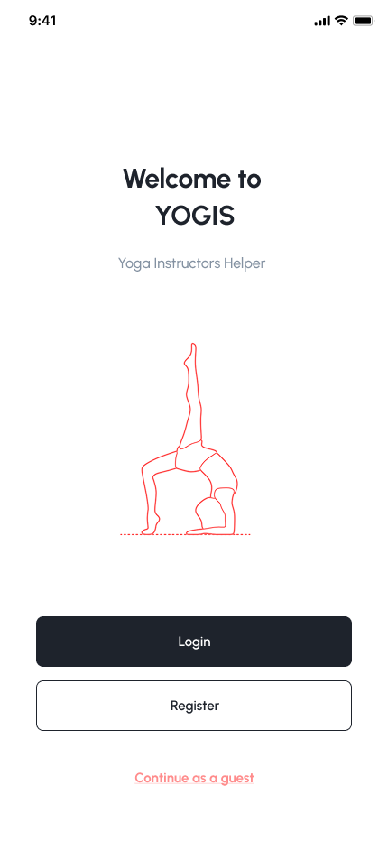

# Yogis — Yoga Class Builder & Teaching Companion

Final project for the Mobile Application Development course. **Yogis** helps yoga instructors browse poses, compose **class plans**, and teach from a clean, step‑by‑step view.

> **Status:** Active student project. Kotlin‑only codebase. Firebase‑backed (Authentication, Realtime Database, Storage).

---

## ✨ Highlights
- **Pose Library** — 38 curated poses with names (Sanskrit/English), levels, tags (body focus), short how‑to, benefits & cautions, plus images hosted in Firebase Storage.
- **Class Plan Builder** — add poses and flows, and save as a **Class Plan** to Firebase. Designed for quick lesson planning during prep.
- **Teaching Mode** — a focused, swipeable walkthrough of the class plan you built (Fragment‑based with arguments per session/pose). Ideal for guiding a live class.
- **Profiles** — basic profile view/edit keyed by **email as identifier** (post‑refactor).
- **Realtime updates** — data comes from Firebase Realtime Database; media from Firebase Storage.

---

## 📊 Market Research & Positioning
- **Down Dog** — excellent for personal practice; no dedicated instructor tools.
- **Asana Rebel** — yoga + fitness lifestyle focus; lacks true class‑planning features.
- **Alo Moves** — great video library but geared toward content consumption, not teaching tools.
- **Mindbody** — booking & studio management; built for businesses, not individual instructors.

> **Gap:** No existing app directly targets *instructors* with planning + in‑class guidance. **Yogis** fills that gap.

---

## 📂 Project Structure (key packages)
```
app/
  src/main/java/com/tamara/a25b_11345b_yogis/
    data/
      firebase/       # Firebase helpers (paths, DTOs/mappers), low-level access
      model/          # Core models: Pose, Flow, MediaAsset, etc.
      repository/     # PoseRepository, FlowRepository — mediates data access
    ui/
      auth/           # Login / Signup (email as identifier)
      builder/        # Class Plan builder screens & logic
      library/        # Pose library list & details
      main/           # Home/host screens & navigation entry
      profile/        # View/Edit user profile
      shared/         # Reusable adapters, view holders, common UI pieces
      teaching/       # Teaching mode (step-by-step sequence)
    utils/            # Navigation helpers, extensions, small utilities
    viewmodel/        # AndroidX ViewModels for MVVM
  src/main/res/       # Layouts, drawables, fonts (e.g., Urbanist)
  MainActivity.kt
```

---

## 🎨 UI/UX Design (Figma)

The full set of screen designs lives here:  
**[`docs/FigmaScreens_Design`](docs/FigmaScreens_Design)**

**Design goals.** Instructor-first, minimal distraction during class, high contrast, large readable type (Urbanist), Material 3 components.

**Design → Code map (quick):**
- **Auth:** Login / Register → `LoginFragment`, `RegisterFragment`
- **Home:** Entry to Library/Builder/Teaching/Profile → `MainLoggedInFragment`
- **Pose Library:** Lists, filters, details → `PoseLibraryFragment`, `PosesListFragment`, `PoseDetailFragment`
- **Class Builder:** Compose, reorder, save plan → `ClassBuilderFragment`, `ClassBuilderAddPoseFragment`, `ClassBuilderAddFlowFragment`
- **Teaching Mode:** Step-by-step view → `TeachingModeFragment`
- **Profile:** View & edit → `ProfileFragment`, `EditProfileFragment`

### 📸 Preview (selected screens)
<!-- Tip: replace the filenames below with actual exports from docs/FigmaScreens_Design.
     Keep width ~260–320 so the grid looks good on GitHub. -->
<p align="center">
  
  
</p>
<p align="center">
  
  
  
</p>

---

## 🧩 Architecture (MVVM)
- **UI (Fragments/Activities)** render state and forward user intents.
- **ViewModel** holds screen state and business logic; talks to repositories (Kotlin coroutines).
- **Repositories** abstract Firebase; they orchestrate reads/writes to Realtime Database and Storage.
- **Data layer** includes Firebase helpers, DTOs, and mappers (if needed) to keep models/UI clean.

Benefits: testable layers, single source of truth, and clear separation between UI and data.




---

## 🎨 Design (Figma) & Screens
**Design goals:** instructor‑first, minimal distraction in class, large readable typography, high contrast, simple navigation.

**Primary screens** (as implemented in the app and reflected in the Figma set):
- **Auth** — login / signup (email as identifier)
- **Home** — entry points to Library, Class Plan Builder, Teaching Mode, Profile
- **Pose Library** — list + filters; **Pose Details** with image and key tips
- **Class Plan Builder** — add from library, reorder, remove, set recommended rounds
- **Teaching Mode** — step‑by‑step sequence view with next/previous controls
- **Profile** — view & edit basic info
---

## 🗄️ Data Model (Firebase)
This project uses **Firebase Realtime Database** (for structured data) and **Firebase Storage** (for images). Data is shaped and validated with **Draft‑07 JSON Schemas** (see `docs/schemas/`).

### Core collections
- **poses** — individual pose documents (see `poseMetadata.json`).
- **mediaAssets** — image metadata for poses (see `mediaAsset.json`).
- **flows** — reusable sub‑sequences of poses (see `flowMetadata.json`).
- **classPlans** — full class plans that can mix poses and flows (see `classPlanMetadata.json`).
- **users** — instructor profile (see `userMetadata.json`).

### Example — Pose
```json
{
  "id": "adho_mukha_svanasana",
  "name": "Adho Mukha Svanasana",
  "level": "beginner",
  "category": "standingPoses",
  "duration": 30,
  "description": "Lengthens posterior chain; builds shoulder stability.",
  "notes": "Avoid with wrist injury.",
  "image": "https://.../pose_images%2Fadho_mukha_svanasana.png?alt=media"
}
```

### Example — Flow
```json
{
  "flowId": "sun_salutation_a",
  "flowName": "Sun Salutation A",
  "level": "beginner",
  "numberOfPoses": 12,
  "recommendedRounds": 3,
  "poses": [
    { "id": "tadasana", "name": "Tadasana", "level": "beginner", "category": "standingPoses", "duration": 10, "description": "...", "image": "https://.../tadasana.png" },
    { "id": "uttanasana", "name": "Uttanasana", "level": "beginner", "category": "forwardBends", "duration": 20, "description": "...", "image": "https://.../uttanasana.png" }
  ]
}
```

### Example — Class Plan
```json
{
  "planId": "intro_vinyasa_45",
  "userId": "<firebase-uid>",
  "planName": "Intro Vinyasa (45m)",
  "level": "beginner",
  "numberOfElements": 8,
  "duration": 45,
  "elements": [
    { "id": "tadasana", "name": "Tadasana", "level": "beginner", "category": "standingPoses", "duration": 10, "description": "...", "image": "https://.../tadasana.png" },
    { "flowId": "sun_salutation_a", "flowName": "Sun Salutation A", "level": "beginner", "numberOfPoses": 12, "recommendedRounds": 2, "poses": [/* ... */] }
  ]
}
```

---

## 🚀 Getting Started

### Prerequisites
- Android Studio (latest stable)
- Android SDK + emulator or a physical device
- A Firebase project with **Authentication**, **Realtime Database**, and **Storage** enabled

### 1) Clone
```bash
git clone https://github.com/AloniTamar/25B-11345B-Yogis.git
cd 25B-11345B-Yogis
```

### 2) Firebase setup
1. Create a Firebase project and add an **Android app** (`applicationId` matches the app module).
2. Download `google-services.json` and place it under `app/`.
3. In Firebase console:
   - **Authentication** → Sign‑in method → enable **Email/Password**.
   - **Realtime Database** → create DB (start in *test mode* for development) and set location.
   - **Storage** → create default bucket. Upload pose images to `pose_images/` and set rules for dev.
4. (Optional) Import your initial `poses`, `mediaAssets`, `flows`, and `classPlans` JSON into Realtime Database.

### 3) Build & run
Open the project in Android Studio → *Sync Gradle* → Run on emulator/device.

---

## 🧭 Feature Walkthrough
- **Pose Library** — scrollable list, search/filter by level or tag (as implemented). Tap for details and image.
- **Class Plan Builder** — add poses from the library, reorder, remove, set `recommendedRounds`, then **Save** (persists to DB).
- **Teaching Mode** — opens with the saved **Class Plan ID** as a Fragment argument; swipe/next through the sequence.
- **Profile** — view/edit screen bound to the user’s email identity.

---

## 🔒 Security & Keys
- Never commit `google-services.json` or API keys to Git.
- If a key was exposed, rotate in Firebase console and update the file locally.
- For production, tighten Realtime Database & Storage rules and restrict reads/writes to authenticated users.

---

## 🧪 Testing data (quick start)
- Create a test user with email/password.
- Seed a few `poses` and one `classPlan` to see Teaching Mode in action.

---

## 🙌 Credits
- **Course:** Mobile Application Development (final project)
- **Fonts:** Urbanist (in `res/font/`)
- **Images:** 2013-2025 WorkoutLabs, LLC. All rights reserved.

---

## 📬 Contact
Author: **Tamar Aloni**  
Project repo: `AloniTamar/25B-11345B-Yogis`
